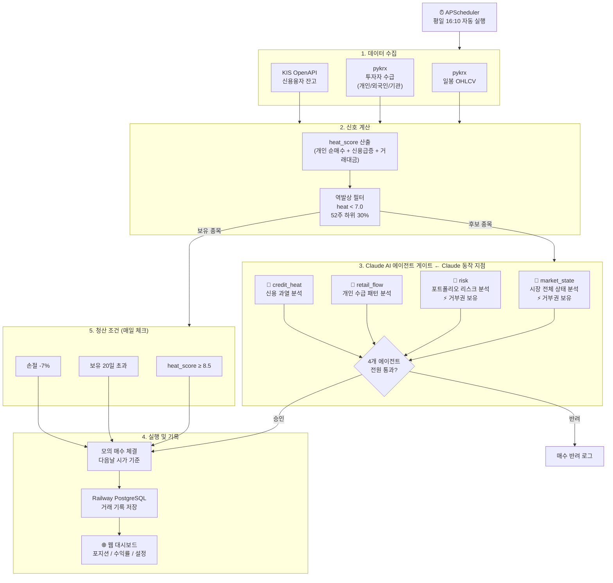

# WarrenBuffettBot

한국 주식 역발상(Contrarian) 자동매매 시스템.
개인투자자 과열 신호를 감지하고, Claude AI 에이전트 합의를 거쳐 모의/실전 매매를 실행합니다.

---

## 전체 프로세스 흐름



---

## Claude AI 에이전트 역할

| 에이전트 | 분석 내용 | 거부권 |
|---------|----------|--------|
| `market_state` | 시장 전체 하락 종목 비율 — 70% 이상이면 전체 청산 강제 | ✅ |
| `risk` | 슬롯 부족 또는 동일 업종 3개 이상 보유 시 관망 강제 | ✅ |
| `retail_flow` | 개인 순매수 급증 패턴 → 과열 여부 판단 | ❌ |
| `credit_heat` | 신용잔고 급증 → 추가 과열 신호 판단 | ❌ |

- `market_state` 또는 `risk`가 거부하면 즉시 반려
- 나머지 2개는 **2/2 합의** 필요
- 결과는 `agent_decisions` 테이블에 기록 (캐싱으로 동일 입력 재호출 방지)

---

## 기술 스택

| 역할 | 기술 |
|------|------|
| 주가 데이터 | pykrx, FinanceDataReader |
| 주문 실행 | 한국투자증권 KIS OpenAPI |
| AI 판단 | Anthropic Claude API (claude-sonnet-4-6) |
| DB | Railway PostgreSQL |
| 스케줄러 | APScheduler (평일 16:10) |
| 웹 대시보드 | FastAPI + Jinja2 |
| 배포 | Railway (web + worker) |

---

## 단위 테스트

DB/Claude API/KIS API를 전부 mock으로 격리한 순수 단위 테스트입니다 (실제 네트워크·DB 연결 없이 1~2초 내 완료).

```bash
pip install -r requirements-dev.txt
pytest tests/ -v
```

- `test_cost_model.py`, `test_signals.py` — 비용모델/heat_score 계산 (순수 함수)
- `test_agents_base.py`, `test_gate.py` — Claude API 캐싱/파싱, 4-에이전트 veto·합의 로직
- `test_contrarian.py`, `test_paper.py` — 진입/청산 후보 필터링, 모의매매 체결
- `test_connection.py` — DB 커넥션 롤백/재연결 회귀 테스트 (2026-08-10 장애 재발 방지)
- `test_engine.py` — 백테스터 중복 포지션 버그 회귀 테스트 (2026-08-10 수정 건 재발 방지)

---

## 실행 방법 (로컬)

```bash
# 의존성 설치
pip install -r requirements.txt

# DB 초기화
python setup_db.py

# 데이터 수집
python collector/stock_daily.py

# 대시보드 실행
uvicorn dashboard.app:app --reload --port 8000

# 스케줄러 즉시 실행 (테스트)
python scheduler.py --now
```

---

## 환경변수 (.env)

```
DB_URL=postgresql://...
CLAUDE_API_KEY=sk-ant-...
KIS_APP_KEY=...
KIS_APP_SECRET=...
KIS_ACCOUNT=계좌번호
KIS_ACCOUNT_SUFFIX=01
KIS_MOCK=true        # 모의투자
KIS_MODE=paper

# 투자자별 수급(investor_flow) 수집에 필요 (data.krx.co.kr 무료 회원가입)
KRX_ID=...
KRX_PW=...
```

> `KRX_ID`/`KRX_PW`가 없으면 개인/외국인/기관 순매수 데이터가 전혀 수집되지 않습니다 (KRX 서버가 로그인 세션 없이는 빈 응답만 반환).

---

## 백테스트 & 검증 스크립트

과거 데이터로 전략을 검증하거나, heat_score 신호가 실제로 수익률과 관계가 있는지 확인할 때 사용합니다.

```bash
# 1. contrarian_signals 사전 계산 (백테스트 대상 기간)
python backfill_signals.py 2022-01-01 2024-12-31

# 2. 로컬 백테스트 (진입/청산 시뮬레이션 + 기간분리·부트스트랩·무작위대조군 검증)
python run_backtest_local.py 2022-01-01 2024-12-31

# 3. 분위수(decile) 분석 — 문턱값 없이 heat_score/개인수급/거래대금과
#    향후 수익률의 관계 확인, KOSPI 벤치마크 대비 초과수익 비교
python decile_analysis.py 2022-01-01 2024-12-31
```

`backtester/engine.py`(원본 서버사이드 백테스터)도 동일 기능을 제공하지만, DB 디스크 여유가 부족한 환경에서는 `run_backtest_local.py`를 대신 사용하세요 (동일 비용모델 `backtester/cost_model.py`를 그대로 재사용해 결과가 일치합니다).

---

## 모의 → 실전 전환 기준

- 모의 거래 30건 이상
- 슬리피지 실측 ≤ 0.2%
- MDD ≤ 백테스트 대비 150%

`.env`에서 `KIS_MOCK=false`, `KIS_MODE=live` 로 변경하면 실전 전환됩니다.
